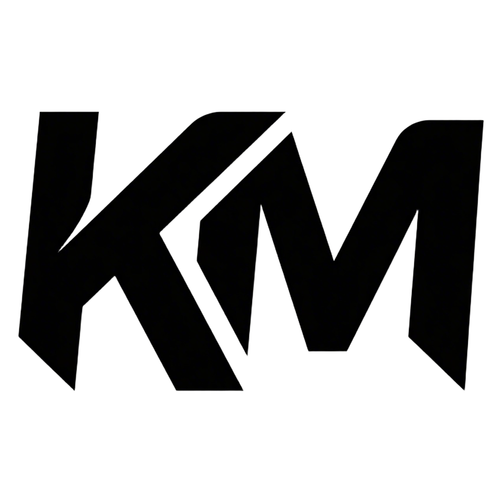

# kmin.js

<center>
    
</center>

kmin.js 是一个基于 web component 的前端组件框架，它的目标是简化前端开发，提高开发效率。

## 安装

```html
<script src="./kmin.min.js"></script>
```

## 示例一

编写组件 `demo-ui`

```js
// -------------------定义组件名称:demo-ui -------------------
customElements.define('demo-ui', class extends KMin {
    // 自定义动态数据
    data = this.state({
        count: 0,
        name: 'kmin',
    })

    // 增加
    increment() {
        this.data.count++;
        console.log(this.data.count)
    }
    // 减少
    decrement() {
        this.data.count--;
        console.log(this.data.count)
    }
    // 重置
    reset() {
        this.data.count = 0;
        console.log(this.data.count)
    }
    // 自定义css
    css() {
        return `
        span{
            color: red;
        }
        `
    }
    // 渲染模板
    render() {
        return `
        <div class="counter">
            <button @click="decrement">-</button>
            <span>Count: {{data.count}}</span>
            <button @click="increment">+</button>
        </div>
        <button @click="reset">Reset</button>
        `;
    }
});
```

使用组件 `demo-ui`
```html
<!-- 使用组件 -->
<demo-ui></demo-ui>
<!-- 引入组件js -->
<script type="module" src="./demo-ui.js"></script>
```

## 示例二

`html模板`式使用

```html
<template>
    <!-- 这里写渲染模板内容 -->
    <div>
        <span>Hello, {{data.name}}!</span>
    </div>
</template>
<script type="module">
    customElements.define('demo-ui', class extends KMin {
        // 自定义动态数据
        data = this.state({
            name: 'kmin',
        })
    })
</script>
<style>
    /* 这里写组件css */
    span{
        color: red;
    }
</style>
```
使用组件 `demo-ui`
```html
<!-- 使用组件 -->
<demo-ui></demo-ui>
<!-- 引入组件js -->
<script>
    // 使用impComp函数激活
    impComp("./demo-ui.html")
</script>
```
